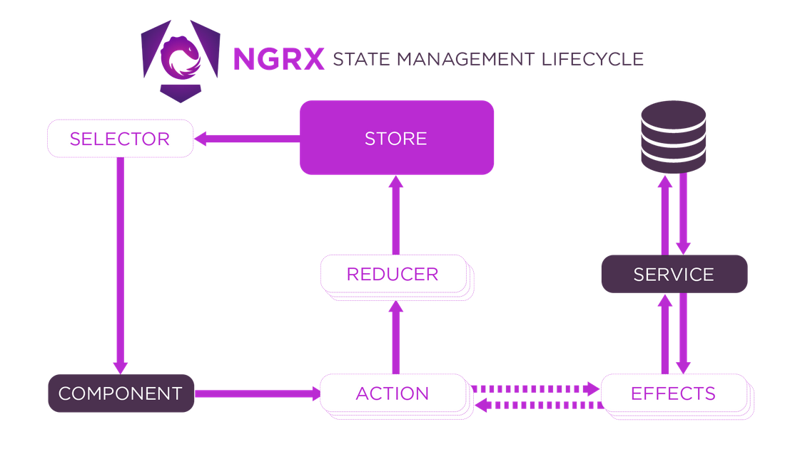

# NgRx Tutorial

### Componentes

**Store** - Estado de la aplicación

**Actions** - Eventos únicos lanzados desde componentes o servicios

**Reducers** - Modifican el estado a partir del estado anterior y la última acción que lo modifica

**Effects** - Interacciones externas solicitadas por los Reducers para modificar el estado de la aplicación. 
Realizan tareas síncronas o asíncronas y devuelven una nueva acción.

**Services** - Serán inyectados a los efectos para ejecutar tareas concretas.

**Selectors** - Fracciones concretas del estado

**Store** - Método para acceder al estado

### Ciclo de vida

### General

El método *StoreModule.forRoot()* registra de forma global los elementos que accederán al Store de la aplicación.